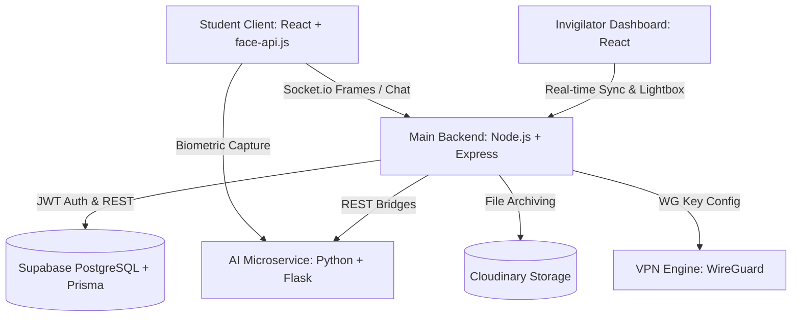

# 🛡️ ProctorNet: Forensic-Grade Online Exam Proctoring System

[](https://nodejs.org/)
[](https://reactjs.org/)
[](https://python.org/)
[](https://prisma.io/)
[](https://tailwindcss.com/)
[](LICENSE)

ProctorNet is a secure, network-isolated, and forensic-grade online examination proctoring system engineered specifically for college lab and classroom environments. By fusing **real-time browser biometrics**, **high-performance socket synchronization**, **dlib face recognition**, and **WireGuard network-level blocking**, ProctorNet provides unparalleled security and anti-cheating mechanisms without visual delay.

---

## 🎯 Key Highlights

*   ⚡ **High-Frequency Real-Time Proctoring**: Decoupled Reactive Pub-Sub dual-stream feed (Webcam + Screen Sharing) that scales to multiple concurrent students with **sub-2% CPU consumption** and zero slideshow lag.
*   🧠 **Biometric Identity Verification**: Front-end facial landmarking (`face-api.js`) coupled with back-end `face_recognition` (dlib) and system Tesseract OCR to perform strict **ID-to-Live Face Verification** and continuous presence audits.
*   🕵️‍♂️ **Forensic Leak Prevention**: Dynamic session-based invisible Canvas watermarks applied to student UI layouts to trace exam screen leaks back to the precise session, device, and candidate.
*   🔌 **Network-Level Collusion Control**: Built-in WireGuard VPN engine to isolate examination PCs, completely blocking external search engines and candidate-to-candidate local communications.
*   💻 **Premium Invigilator Control HUD**: Slate-themed dashboard featuring real-time warning dispatches, active dossier timelines, direct chat, and interactive **high-fidelity Lightbox overlays** showing violation images and telemetry.

---

## 🏗️ System Architecture

ProctorNet utilizes a highly optimized three-tier distributed microservice architecture:



### 1. The Presentation Tier (React + Vite)
-   **Aesthetics**: Glassmorphic slate-themed design system featuring clean micro-animations, micro-feedback tooltips, and tab filters.
-   **Security Controls**: Monaco Editor core for programming questions, disabled copy-paste events, keyboard shortcut intercepts (e.g., F12, Ctrl+Shift+I), and automated full-screen locks.

### 2. The Core Backend Tier (Node.js + Express)
-   **State Engine**: High-speed custom Event Bus on top of `Socket.io` to channel live webcam and screen captures to proctors without clogging the React render thread.
-   **Access Management**: JWT role-based guard rules protecting Admin, Faculty, Student, and Invigilator resources.

### 3. The Intelligent Microservice (Python + Flask)
-   **Facial Recognition**: Computes deep dlib face embeddings to match live candidate webcam captures against database profile pictures.
-   **OCR ID Parsing**: Employs Tesseract OCR to automatically inspect and extract registration details from uploaded physical student ID cards during lobby onboarding.

---

## 🚀 Getting Started

### 📋 Prerequisites

Ensure your host machine has the following tools installed:
-   **Node.js** (v18.x or above)
-   **Python** (v3.9 or above)
-   **Tesseract OCR Engine** ([Install Guide](https://github.com/tesseract-ocr/tesseract))
-   **Git**

---

### 🛠️ Step-by-Step Installation

#### 1. Clone the Repository
```bash
git clone https://github.com/SudeepKagi/online-exam-proctoring.git
cd online-exam-proctoring/proctornet
```

#### 2. Configure Environment Files
Configure the respective variables in each service directory:

##### Backend env (`backend/.env`):
```env
PORT=5000
DATABASE_URL="your-supabase-postgresql-connection-string"
JWT_SECRET="your-high-security-jwt-secret-string"
CLOUDINARY_CLOUD_NAME="your-cloudinary-name"
CLOUDINARY_API_KEY="your-cloudinary-key"
CLOUDINARY_API_SECRET="your-cloudinary-secret"
PYTHON_SERVICE_URL="http://localhost:8000"
```

##### Frontend env (`frontend/.env`):
```env
VITE_API_URL="http://localhost:5000/api"
VITE_SOCKET_URL="http://localhost:5000"
```

##### Python Service env (`python-service/.env`):
```env
PORT=8000
HOST="127.0.0.1"
```

---

#### 3. Frontend Setup
```bash
cd frontend
npm install
npm run dev
```
*Frontend will now boot locally at* `http://localhost:5173`.

#### 4. Backend Setup
```bash
cd ../backend
npm install
npx prisma generate
npx prisma db push
npm run dev
```
*Backend will launch its HTTP and Socket listener on port* `5000`.

#### 5. AI Python Service Setup
```bash
cd ../python-service
# Create and activate virtual environment
python -m venv venv
source venv/bin/activate  # On Windows: venv\Scripts\activate
pip install -r requirements.txt
python app.py
```
*Flask AI service will start processing biometric match request payloads on port* `8000`.

---

## 🔐 Role Access Telemetry

To initialize and audit the examination cycle:

| Portal | Endpoint Route | Default Credentials | Description |
| :--- | :--- | :--- | :--- |
| **Admin Portal** | `/admin/login` | `admin@proctornet.com` / `Admin@123` | Approves new Faculty signups, inspects audit logs, and monitors system health. |
| **Faculty Portal** | `/faculty/login` | *(Registered & approved)* | Creates questions bank, deploys examinations, and reviews violation logs. |
| **Student Lobby** | `/student/login` | *(Registered via USN)* | Conducts biometric verification, takes active exam under locked full-screen. |
| **Invigilator HUD** | `/invigilator/login` | *(Assigned credentials per exam)* | Accesses real-time streaming, chat log, alerts sidebar, and lightbox dossier overlay. |

---

## 🛡️ Forensic Security Measures

1.  **Tab Switch Interceptor**: Instantly flags tab alterations or application switches, adding warnings to the timeline. Exceeding 5 warnings auto-locks the test sheet.
2.  **DevTools Inhibitor**: Monitors console resizing and shortcuts to completely lock standard browser exploration utilities.
3.  **Watermark Embedder**: Dynamically injects forensic grids into the view. In the event of secondary device capture (e.g. taking a smartphone camera picture), the screenshot can be analyzed to trace the leak origin immediately.
4.  **Decoupled Streams**: Invigilator feeds are managed via a custom browser custom-event bus, ensuring rendering performance never degrades during exam crises.

---

## 📄 License
This project is licensed under the MIT License - see the [LICENSE](LICENSE) file for details.

---

<div align="center">
  <sub>Engineered with 💙 by Advanced Agentic Coding for the ultimate proctoring fidelity.</sub>
</div>
