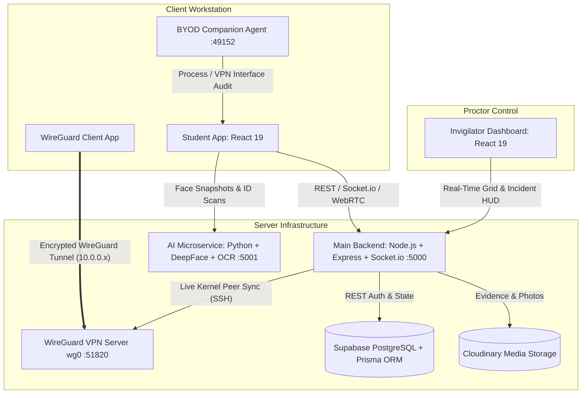

# 🛡️ ProctorNet: Online Exam Proctoring & Network Isolation System

[](https://nodejs.org/)
[](https://reactjs.org/)
[](https://python.org/)
[](https://www.wireguard.com/)
[](https://prisma.io/)
[](https://tailwindcss.com/)
[](LICENSE)

ProctorNet is a comprehensive, real-time online examination proctoring and laboratory network containment platform. Engineered for university exams and BYOD (Bring Your Own Device) testing environments, ProctorNet pairs **kernel-level WireGuard VPN network isolation** and a **local process audit companion agent** with **real-time AI biometric verification**, **ID card OCR validation**, and **dual-stream WebRTC/Socket.io video invigilation**.

---

## 🏗️ System Architecture & Subsystems

ProctorNet operates as an integrated multi-tier microservices architecture:


```mermaid
graph TD
    %% Client Tier
    subgraph Client Workstation
        Student[Student App: React 19]
        WGClient[WireGuard Client App]
        Agent[BYOD Companion Agent :49152]
    end

    %% Invigilator Tier
    subgraph Proctor Control
        Invigilator[Invigilator Dashboard: React 19]
    end

    %% Cloud & Server Tier
    subgraph Server Infrastructure
        NodeServer[Main Backend: Node.js + Express + Socket.io :5000]
        AIService[AI Microservice: Python + DeepFace + OCR :5001]
        WGServer[WireGuard VPN Server wg0 :51820]
        DB[(Supabase PostgreSQL + Prisma ORM)]
        Cloudinary[(Cloudinary Media Storage)]
    end

    %% Connections
    Student -- REST / Socket.io / WebRTC --> NodeServer
    Student -- Face Snapshots & ID Scans --> AIService
    Agent -- Process / VPN Interface Audit --> Student
    WGClient == Encrypted WireGuard Tunnel (10.0.0.x) ==> WGServer
    NodeServer -- Live Kernel Peer Sync (SSH) --> WGServer
    NodeServer -- REST Auth & State --> DB
    NodeServer -- Evidence & Photos --> Cloudinary
    Invigilator -- Real-Time Grid & Incident HUD --> NodeServer
```

### Stack Summary

| Layer | Technologies | Responsibilities |
| :--- | :--- | :--- |
| **Frontend** | React 19, Vite, Tailwind CSS, Monaco Editor, Lucide Icons | Student exam portal, code IDE, BYOD diagnostics, invigilator monitoring grid. |
| **Backend Gateway** | Node.js (v18+), Express, Socket.io, Prisma ORM, JWT, Helmet | API routing, state management, socket signaling, live WireGuard peer cloud sync. |
| **Network Isolation** | WireGuard (`wg0`), Linux Kernel, UDP 51820 | Cryptographic tunnel (`10.0.0.0/24`), outbound communication containment. |
| **Companion Agent** | Node.js native desktop agent (`127.0.0.1:49152`) | Local process inspection (AnyDesk, TeamViewer, virtual cams), VPN adapter verification. |
| **AI Microservice** | Python 3.9+, Flask, DeepFace (ArcFace / FaceNet), OpenCV, Tesseract | Biometric identity verification, student ID OCR parsing, live video frame inference. |
| **Database & CDN** | PostgreSQL (Supabase), Cloudinary | Persistent records, session watermark seeds, audit logs, and photo/snapshot evidence. |

---

## 🛡️ Core Engineering Modules

### 1. 🔒 Kernel-Level WireGuard VPN Network Isolation
- **Cryptographic Profile Issuance**: On demand (`POST /api/vpn/issue/:examId`), the backend dynamically generates a Curve25519 (`x25519`) keypair and allocates an IP from the dedicated subnet pool (`10.0.0.2` – `10.0.0.254`).
- **Live Cloud Kernel Sync**: The backend directly registers the student's public key with the live WireGuard server interface via SSH (`sudo wg set wg0 peer <pubKey> allowed-ips <ip>/32`), eliminating manual server administration.
- **Client Profile Generation**: Provides a ready-to-import `.conf` configuration file for the desktop WireGuard client.
- **Dynamic Lease Revocation**: When the exam concludes or is submitted, `/api/vpn/revoke/:examId` immediately drops the peer from kernel memory (`sudo wg set wg0 peer <pubKey> remove`).

---

### 2. 🖥️ BYOD Device Companion Agent
A lightweight local agent running at `http://127.0.0.1:49152`:
- **Unauthorized Process Scanner (`/scan`)**: Audits running system processes to flag banned remote desktop applications (AnyDesk, TeamViewer, UltraViewer, Chrome Remote Desktop, RDP/mstsc, VNC) and virtual camera drivers (OBS Virtual Camera, ManyCam, vMix).
- **Interface & Tunnel Verification (`/vpn-check`)**: Inspects local system network adapters (`ipconfig /all` on Windows or `ip addr` on Linux) to confirm that the `10.0.0.x` WireGuard tunnel is active prior to exam access.

---

### 3. ⚡ Decoupled Live Video Stream & WebRTC Ref-Buffer
- **Socket.io Video Relay**: Student cameras and screen shares emit compressed base64 JPEG frames at 1.5-second intervals.
- **Ref-Based Buffer Storage**: The invigilator dashboard buffers incoming frame payloads in `latestFramesRef` to bypass React component tree re-rendering bottlenecks during large-batch exams.
- **Isolated Event Bus**: Individual `<WebcamFeed />` and `<ScreenFeed />` components subscribe only to their own `studentId` events, maintaining 60 FPS UI responsiveness.
- **WebRTC Peer Streaming**: Negotiates direct P2P WebRTC streams with fallback to Socket.io relay when NAT traversal restricts peer connectivity.

---

### 4. 🧠 Biometric Entry & ID OCR Verification
- **Tesseract OCR Parsing**: Scans uploaded university ID cards to validate and extract student University Seat Numbers (USN) matching institutional patterns (`[1-4][A-Z]{2}[0-9]{2}[A-Z]{2}[0-9]{3}`).
- **DeepFace Biometric Matching**: Calculates facial vector distance using ArcFace with FaceNet fallback to verify live webcam snapshots against registered profile photographs.
- **Fail-Closed Policy**: Security-critical verifications strictly evaluate to `verified: false` if any upstream AI service, camera feed, or network check fails.

---

### 5. 🕵️‍♂️ Kiosk Integrity & Forensic Audit Logging
- **Kiosk Enforcer**: Fullscreen enforcement, tab-switch detection (`visibilitychange`), window blur tracking, and multi-monitor screen sharing audits.
- **Forensic Snapshots**: Simultaneous dual-frame capture (webcam + screen) automatically archived to Cloudinary upon violation trigger.
- **Session-Bound Watermarking**: Dynamic canvas watermarks with cryptographically seeded coordinates prevent off-screen photography leaks.

---

## 🚀 Getting Started

### System Prerequisites
- **Node.js** (v18.x or v20.x+)
- **Python** (v3.9 or above)
- **Tesseract OCR Engine** ([Installation Guide](https://github.com/tesseract-ocr/tesseract))
- **WireGuard Desktop Client** ([Download WireGuard](https://www.wireguard.com/install/))

---

### Running the System (4 Services)

To run the complete platform, start the four companion services in separate terminal windows:

#### Terminal 1 — Backend API Gateway
```bash
cd proctornet/backend
npm install
npx prisma generate
npx prisma db push
npm start
```
*Runs on port `5000`.*

#### Terminal 2 — AI Microservice
```bash
cd proctornet/python-service
# Optional: create and activate virtualenv
python -m venv venv
# Windows: venv\Scripts\activate | Linux/macOS: source venv/bin/activate
pip install -r requirements.txt
python app.py
```
*Runs on port `5001`.*

#### Terminal 3 — Frontend Web Application
```bash
cd proctornet/frontend
npm install
npm run dev
```
*Runs on `http://localhost:5173`.*

#### Terminal 4 — BYOD Device Companion Agent
```bash
cd proctornet/device-agent
node agent.js
```
*Runs on `http://127.0.0.1:49152`.*

---

## 🧪 Testing & Verification

### Automated Backend Tests
Run the automated test suite to verify controller architectural boundaries, regression guardrails, and fail-closed security logic:
```bash
cd proctornet/backend
npm test
```

### Verifying WireGuard Network Isolation
1. Log in to the frontend at `http://localhost:5173` as a student (Demo USN: `1VE22CS999`, Password: `Student@123`).
2. Navigate to **My Exams** → select an active exam → click **Run Device Diagnostic**.
3. Under **WireGuard Network Isolation**, click **Issue WireGuard VPN Profile**.
4. Import the downloaded `.conf` file into the WireGuard desktop application and click **Activate**.
5. Click **Verify VPN Tunnel Status** in the browser to confirm tunnel detection via the local companion agent.

---

## 📄 License
This project is licensed under the MIT License - see the [LICENSE](LICENSE) file for details.
