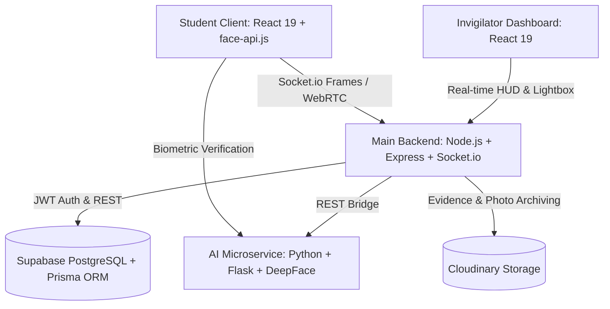

# 🛡️ ProctorNet: Online Exam Proctoring & Lab Security System

[](https://nodejs.org/)
[](https://reactjs.org/)
[](https://python.org/)
[](https://prisma.io/)
[](https://tailwindcss.com/)
[](LICENSE)

ProctorNet is a real-time online examination proctoring system engineered for college laboratory and classroom environments. Combining **browser-side face detection (`face-api.js`)**, **dual-stream Socket.io + WebRTC synchronization**, **DeepFace (ArcFace) biometric verification**, **Tesseract OCR parsing**, and **continuous kiosk & screen integrity enforcement**, ProctorNet provides continuous multi-role invigilator awareness.

> [!NOTE]
> **Network Isolation Note**: Dedicated kernel-level WireGuard VPN network isolation is planned for a future phase. Current network integrity is enforced through browser kiosk lock, client-side subnet matching, device agent audits, and secure tokenized transports.

---

## 🏗️ System Architecture & Stack

ProctorNet uses a multi-tier microservices architecture:


```mermaid
graph TD
    %% Clients
    Student[Student Client: React 19 + face-api.js]
    Invigilator[Invigilator Dashboard: React 19]
    
    %% API Gateways & Servers
    NodeServer[Main Backend: Node.js + Express + Socket.io]
    AIService[AI Microservice: Python + Flask + DeepFace]
    
    %% Storage
    DB[(Supabase PostgreSQL + Prisma ORM)]
    Cloudinary[(Cloudinary Storage)]
    
    %% Flow Connections
    Student -- Socket.io Frames / WebRTC --> NodeServer
    Student -- Biometric Verification --> AIService
    Invigilator -- Real-time HUD & Lightbox --> NodeServer
    NodeServer -- JWT Auth & REST --> DB
    NodeServer -- REST Bridge --> AIService
    NodeServer -- Evidence & Photo Archiving --> Cloudinary
```

### Stack Summary
- **Frontend**: React 19, Vite, Tailwind CSS, `face-api.js` (TinyFaceDetector), Monaco Editor (`@monaco-editor/react`), Lucide React.
- **Main Backend**: Node.js (v18+), Express, Socket.io (real-time broker), Prisma ORM, JWT, Helmet, Express-Rate-Limit.
- **Database**: PostgreSQL (Supabase cloud database with connection pooling).
- **AI Service**: Python (v3.9+), Flask, DeepFace (ArcFace with FaceNet fallback), PyTesseract OCR, OpenCV, NumPy.
- **Media CDN**: Cloudinary for student photo dockets, ID scans, and violation snapshots.

---

## 🛡️ Core Features & Engineering Modules

### 1. ⚡ Decoupled Live Stream Ref-Buffer
- **Socket.io Frame Relay**: Student cameras and screen shares emit compressed base64 JPEG frames at 1.5-second intervals.
- **Ref-Based Buffer Storage**: The invigilator dashboard buffers incoming frame payloads in `latestFramesRef` to bypass React's heavy component tree re-rendering.
- **Custom Event Bus**: Individual `<WebcamFeed />` and `<ScreenFeed />` components subscribe only to their own `studentId` events, resulting in isolated single DOM node updates.
- **WebRTC Upgrade**: Automatically negotiates P2P WebRTC streams between candidate and invigilator for high-quality low-latency monitoring when network paths allow.

---

### 2. 🧠 Biometric Entry & ID OCR Verification
- **Tesseract OCR Parsing**: Scans uploaded physical student ID cards to extract student USNs (`[1-4][A-Z]{2}[0-9]{2}[A-Z]{2}[0-9]{3}`).
- **DeepFace Biometric Matching**: Calculates facial distance using ArcFace (falling back to FaceNet) to verify live camera snapshots against stored profile images.

---

### 3. 🕵️‍♂️ Session Integrity & Incident Audit
- **Browser Monitoring**: Enforces fullscreen mode, detects tab switching (`blur` & `visibilitychange`), and monitors screen share tracks.
- **Violation Snapshotting**: Captures simultaneous camera and screen evidence images whenever a violation occurs, broadcasting alerts to the invigilator dashboard in real time.
- **Session Watermark**: Generates unique session-bound watermark seeds per student exam instance.

---

## 🚀 Running the Project

### System Requirements
- **Node.js** (v18.x or above)
- **Python** (v3.9 or above)
- **Tesseract OCR Engine** ([Install Guide](https://github.com/tesseract-ocr/tesseract))

---

### Execution Steps

#### 1. Setup Backend
```bash
cd proctornet/backend
npm install
npx prisma generate
npx prisma db push
npm run dev
```
*Backend runs on port `5000`.*

#### 2. Setup AI Microservice
```bash
cd proctornet/python-service
python -m venv venv
# Linux/Mac: source venv/bin/activate | Windows: venv\Scripts\activate
pip install -r requirements.txt
python app.py
```
*AI service runs on port `5001`.*

#### 3. Setup Frontend
```bash
cd proctornet/frontend
npm install
npm run dev
```
*Frontend runs on `http://localhost:5173`.*

---

## 📄 License
MIT License - see [LICENSE](LICENSE) for details.
