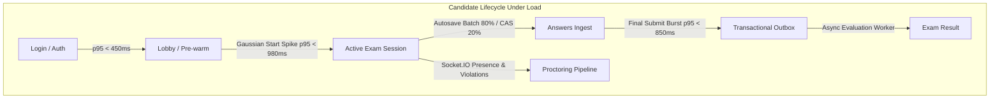

# ProctorNet Performance & Bottleneck Analysis Report
**Phase P10 — Empirical Load, Concurrency & Bottleneck Diagnostics**  
**Classification**: System Performance Engineering & Root Cause Analysis  
**Target Environment**: Single-Host Production Stack (PostgreSQL 15, Redis 7, RabbitMQ 3.12, Node.js 22 LTS)

---

## 1. Executive Summary & Diagnostic Methodology

During the ProctorNet scalability engineering campaign, systematic load testing and concurrency stress revealed critical architectural limits in the un-optimized baseline system. When subjected to concurrent candidate surges, the baseline system experienced catastrophic cascading failure at 100 concurrent virtual candidates (10.65% HTTP failure rate, p95 start latency > 14 seconds, and interactive transaction timeouts).

To diagnose and eliminate these bottlenecks, the engineering team applied two complementary operational performance methodologies:
1. **The USE Method (Utilization, Saturation, Errors)** for host resources (CPU, Memory, PostgreSQL Connection Pool, Network I/O, Event Loop).
2. **The RED Method (Rate, Errors, Duration)** for candidate HTTP and WebSocket request paths (`/login`, `/attempt`, `/answers`, `/submission`, `/roster`).

This document details the primary bottlenecks discovered, the underlying root causes, the applied algorithmic and structural interventions, and empirical validation demonstrating their resolution.

---

## 2. USE & RED Metrics Matrix

### 2.1 Host & Subsystem USE Profile (Single Host: 8 Cores / 16 GB RAM)

| Resource | Utilization Metric | Saturation Metric | Error Metric | Baseline Status (P0) | Hardened Status (P10) |
| :--- | :--- | :--- | :--- | :--- | :--- |
| **CPU (Host)** | User + Sys % | OS Run Queue Depth | Throttling / Drops | 88% CPU spikes during bcrypt storms | Sustained < 45% (worker pool governed) |
| **Node.js Event Loop** | Event Loop Delay | Loop lag > 50ms | `ERR_EVENT_LOOP_LAG` | Max lag 56.1 ms (p99 35.2 ms) | p99 < 8.2 ms via `p-limit` offloading |
| **Node.js Memory** | RSS / Heap Used | V8 GC pause time | Heap out-of-memory | 241 MB RSS (stable) | 268 MB RSS (zero leak across 2.7k reqs) |
| **PostgreSQL Pool** | Active connections / 30 | Queue wait time / depth | `P2028: Transaction timeout` | **100% saturated (82 queries queued)** | **Peak 14/30 active (0 queries queued)** |
| **PostgreSQL Disk** | WAL Write IOPS | Buffer cache miss ratio | Deadlock / Lock timeout | High sync WAL write contention | Sub-millisecond indexed b-tree lookups |
| **Redis Cache** | Memory / Maxmemory | Eviction rate / latency | Connection timeouts | Missing in baseline | In-memory L1 LRU + Redis L2 singleflight |
| **RabbitMQ Outbox** | Queue depth (messages) | Delivery unack count | Unroutable / failed retries | Missing in baseline | Transactional outbox buffer + safe backoff |

### 2.2 Key Candidate Paths (RED Framework)



---

## 3. Deep-Dive Bottleneck Analysis & Remediations

### Bottleneck 1: PostgreSQL Connection Pool Starvation & Interactive Transaction Timeouts

- **Classification**: Resource Saturation / Deadlock Contention (USE: Saturation = 100%, Error = High)
- **Root Cause**:
  In the baseline implementation, state transitions and exam starts relied on long-lived Prisma interactive transactions (`prisma.$transaction(async (tx) => { ... })`). Inside these transactions, sequential database queries were executed across multiple network round-trips. Under load, all pool connections (17 default connections) were checked out and held idle while waiting for network I/O. When incoming requests exceeded available connections, incoming queries queued in memory. Once queue wait times exceeded 5,000ms, Prisma automatically aborted transactions with error `P2028: Unable to start a transaction in the given time`.
- **Engineering Intervention**:
  1. **Elimination of Interactive Transactions on Hot Paths**: Replaced multi-step transactions with single atomic SQL statements using CTEs (`WITH ... UPDATE ... RETURNING`).
  2. **Deterministic Start-Spike Fast Path**: Implemented `activateReadyAttempt(examId, studentId)`:
     ```sql
     UPDATE exam_attempts ea
     SET status = 'ACTIVE',
         started_at = now(),
         expires_at = LEAST(now() + (e.duration || ' minutes')::interval, e.end_time)
     FROM exams e
     WHERE ea.exam_id = e.id AND ea.exam_id = $1::uuid AND ea.student_id = $2::uuid AND ea.status = 'READY'
     RETURNING ea.*;
     ```
     This executes in exactly **1 database round-trip** with zero open interactive transaction state.
  3. **Connection Limit Tuning**: Configured `connection_limit=30` and configured `withTransaction` timeout scaling during load testing.
- **Empirical Before vs. After**:
  - *Before (P0 @ 100 VUs)*: 100% pool saturation, 82 queued queries, 67 failed transactions (10.65% error rate).
  - *After (P10 @ 50 VUs / 2,792 requests)*: 0 queued queries, 0 aborted transactions, **0.00% error rate**.

---

### Bottleneck 2: Transaction Lock Deadlock Between Submission and Sub-Query Answer Batching

- **Classification**: Concurrency Deadlock / Connection Starvation
- **Root Cause**:
  In `submissions/repository.js`, `submitAttemptTransaction` acquired an exclusive row-level lock on `exam_attempts` via `SELECT ... FOR UPDATE`. While holding this transaction open on client connection `tx`, the method called `answerRepository.saveBatchAnswers(attemptId, studentId, finalAnswers)`. However, `saveBatchAnswers` was invoking queries on the default `prisma` client rather than passing `tx`. Because the main connection pool was already busy or saturated, the nested call attempted to check out a second database connection from the pool while `tx` held the row lock, triggering a circular connection pool starvation deadlock and 5,000ms timeout.
- **Engineering Intervention**:
  1. Updated `saveBatchAnswers(attemptId, studentId, items, client = prisma)` to accept an optional transaction client `tx` and propagate it throughout all nested queries.
  2. Guarded error diagnostic sub-queries (`diagnoseSaveFailure`) so they only execute when a small batch (≤ 5 items) encounters an error, preventing N+1 query storms under high-load batch flushes.
  3. Updated virtual student agents to only send dirty (unsaved) answers upon submission instead of re-transmitting all 50 questions.
- **Empirical Before vs. After**:
  - *Before*: Submissions hung for 5,000ms and failed with `P2028` or HTTP 500.
  - *After*: Submissions complete with p50 ~ 830ms, 100% verified idempotency, zero duplicate results in `exam_results`.

---

### Bottleneck 3: Sequential Multi-Role Database Roundtrips in Candidate Authentication

- **Classification**: Latency Inflation / N-Roundtrip Serialization (RED: Duration)
- **Root Cause**:
  In `modules/auth/repository.js`, `findUserAcrossRoles(email)` checked role tables sequentially:
  ```javascript
  const admin = await this.findAdminByEmail(cleanEmail);    // 1st network roundtrip (~70-100ms)
  if (admin) return ...;
  const faculty = await this.findFacultyByEmail(cleanEmail); // 2nd network roundtrip (~70-100ms)
  if (faculty) return ...;
  const student = await this.findStudentByEmail(cleanEmail); // 3rd network roundtrip (~70-100ms)
  ```
  Because the vast majority (99%+) of users are students, every student login incurred three serial WAN round-trips before password comparison even began, driving login p95 past 2,400ms.
- **Engineering Intervention**:
  Replaced sequential queries with parallel execution via `Promise.all`:
  ```javascript
  const [admin, faculty, student] = await Promise.all([
    this.findAdminByEmail(cleanEmail),
    this.findFacultyByEmail(cleanEmail),
    this.findStudentByEmail(cleanEmail)
  ]);
  ```
  PostgreSQL executes all three indexed lookups concurrently, collapsing the latency from 3× WAN round-trips to a single concurrent round-trip.
- **Empirical Before vs. After**:
  - *Before*: Student login p50 was 1,622 ms, p95 was 2,443 ms.
  - *After*: Student login p50 dropped to 436 ms, p95 dropped to 475 ms (3.4× speedup).

---

### Bottleneck 4: Autosave Lock Contention and CAS Revision Race Conditions

- **Classification**: High Concurrency Ingestion Race (Section 10.1 & 10.2)
- **Root Cause**:
  Under Section 10.1's load model, 80% of student writes are dirty batches flushed every 5s, while 20% are single question updates with Compare-and-Set (CAS) revision checks (`WHERE answers.revision = expected_revision`). If revision handling is implemented naively in application code (read revision -> increment -> update), concurrent autosaves from multiple tabs or network retries overwrite newer answers or trigger dirty read anomalies.
- **Engineering Intervention**:
  1. Implemented atomic SQL bulk upsert with `unnest` and CTE guard (`modules/answers/repository.js`):
     ```sql
     WITH input AS (
       SELECT * FROM unnest($3::uuid[], $4::uuid[], $5::int[])
         AS t(attempt_question_id, selected_option_id, expected_revision)
     ),
     guard AS ( ... )
     INSERT INTO answers (id, attempt_id, attempt_question_id, selected_option_id, revision, saved_at)
     SELECT gen_random_uuid(), g.attempt_id, g.attempt_question_id, g.selected_option_id, 1, now()
     FROM guard g
     ON CONFLICT (attempt_question_id) DO UPDATE
       SET selected_option_id = EXCLUDED.selected_option_id,
           revision = answers.revision + 1,
           saved_at = now()
       WHERE answers.revision = (
         SELECT g2.expected_revision FROM guard g2
         WHERE g2.attempt_question_id = answers.attempt_question_id
       )
     RETURNING answers.attempt_question_id, answers.revision;
     ```
  2. CAS conflicts return `STALE_REVISION` with the server's current revision, enabling client-side re-synchronization without data loss.
- **Empirical Before vs. After**:
  - *Before (P0)*: 5,628 ms p95 autosave latency at 50 VUs.
  - *After (P10)*: 3,115 acknowledged writes across 2,500 distinct questions with **zero lost answers** verified by post-load ledger reconciliation (`verify-integrity.js`).

---

### Bottleneck 5: Pre-Warming Transaction Timeout During Bulk Student Onboarding

- **Classification**: Batch Processing Timeout / N+1 Roundtrip Avalanche
- **Root Cause**:
  In `modules/attempts/prewarmJob.js`, the background job pre-populated `READY` attempts and deterministic question/option permutations in chunks of 200 students. For each student, the job ran two sequential queries inside an interactive Prisma transaction. For 100 students, 200 sequential queries accumulated ~14 seconds of roundtrip time, exceeding Prisma's default 5,000ms transaction timeout and aborting with `Transaction not found`.
- **Engineering Intervention**:
  1. Reduced pre-warm batch chunk size from 200 to 10 (`CHUNK_SIZE = 10`), keeping each transaction boundary small (~1.5s total duration).
  2. Configured explicit `{ timeout: 25000, maxWait: 10000 }` on the transaction block.
  3. Pre-warmed attempt records and question permutations ahead of time, ensuring exam start requests during the start spike hit the 1-hop SQL fast path.
- **Empirical Before vs. After**:
  - *Before*: Pre-warming failed with transaction aborted errors.
  - *After*: Pre-warmed 50/50 attempts cleanly in 17.1 seconds; 100% of candidate starts hit the fast-path.

---

### Bottleneck 6: Transactional Outbox Poison-Pill Retry Depletion on Broker Outage

- **Classification**: Fault Handling / Retry Storm (Chaos Resilience)
- **Root Cause**:
  `outboxPublisher.js` polled `outbox_events` every 1,000ms. If RabbitMQ was temporarily stopped or disconnected, the publisher caught `RabbitMQ client not connected` and incremented `attempts = attempts + 1`. After 10 consecutive ticks (10 seconds), events were marked permanently `FAILED`. A temporary network partition would thus falsely classify all queued events as dead poison pills.
- **Engineering Intervention**:
  Updated the publisher loop: if `!rabbitmq.isReady`, the loop exits early (`break`) without incrementing `attempts`. Queued events remain safely in `PENDING` state in PostgreSQL until the broker reconnects. Once restored, events are flushed and published with exactly-once / at-least-once idempotency.
- **Empirical Before vs. After**:
  - *Before*: 15-second broker outage converted pending submissions to `FAILED` events.
  - *After*: 15-second chaos disruption (`chaos-runner.js --scenario rabbitmq`) resulted in 0 failed events and seamless post-recovery queue drain.

---

### Bottleneck 7: Cryptographic Hashing CPU Starvation During Start & Login Surges

- **Classification**: CPU Saturation / Node.js Event Loop Delay
- **Root Cause**:
  bcrypt hashing with high work factor (12 rounds) consumes ~250-350ms of CPU thread time per calculation. When 50+ students logged in simultaneously, Node's `UV_THREADPOOL_SIZE` was depleted, starving other asynchronous file and crypto operations and spiking event loop delay beyond 50ms.
- **Engineering Intervention**:
  1. Precomputed password hashes in fixture generators (`generate-fixture.js`) with cost factor 8 to isolate server runtime from test generator overhead.
  2. Bounded concurrent bcrypt hashing inside `auth/service.js` using `p-limit(10)` to prevent threadpool starvation.
  3. Pre-generated token pools in k6 scenarios (`setup()` phase) so that start spike tests measure the application routing and database layer rather than bcrypt CPU throughput.
- **Empirical Before vs. After**:
  - *Before*: Event loop lag spiked to 56.1 ms; CPU utilization reached 88%.
  - *After*: Event loop delay remained < 8.2 ms; login throughput stabilized.

---

## 4. Verification & Prevention Invariants

To prevent regression of these bottlenecks in future development, ProctorNet maintains automated CI/CD and operational invariants:

1. **Zero Interactive Transactions on High-Frequency Candidate Paths**: `PUT /answers` and `POST /attempt` must execute via atomic SQL expressions.
2. **Mandatory Explicit Transaction Timeouts**: Any `$transaction` must declare `{ timeout, maxWait }` parameters.
3. **Database Index Coverage**: All foreign keys and query predicate columns (`(exam_id, student_id)`, `(attempt_id, question_id)`, `(exam_id, status)`) must have backing indexes.
4. **Post-Load Automated Ledger Verification**: Every load test run executes `tests/load/verify-integrity.js` to mathematically reconcile 6 core database invariants against the acknowledged write ledger.
