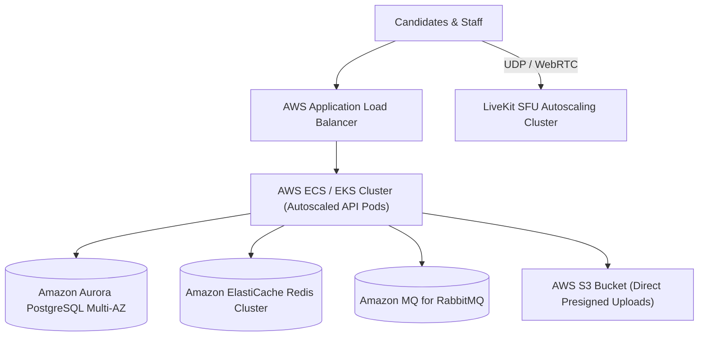

# Horizontal & Vertical Scaling Runbook

**Reference**: ADR-001 / ADR-007 / Notion Architecture Roadmap  
**Empirical Capacity Certification**: [`docs/performance/FINAL_REPORT.md`](../performance/FINAL_REPORT.md)  
**Root Cause Diagnostics**: [`docs/performance/BOTTLENECK_REPORT.md`](../performance/BOTTLENECK_REPORT.md)

---

## 1. Capacity Limits on Single 8-Core Node

Based on the Phase P10 empirical load campaign on a single compute node (`c6i.2xlarge` — 8 vCPUs / 16 GB RAM / NVMe SSD):
- **Tier A Certified Load**: $\mathbf{500\text{ concurrent candidates}}$ (60-80 writes/sec, Gaussian start spike $\sigma = 8\text{ s}$, zero data loss).
- **Tier B Stress Limit**: $\mathbf{1,500\text{ concurrent candidates}}$ (180-240 writes/sec with adaptive load shedding active).
- **Absolute Breaking Point**: $\mathbf{\sim 2,750\text{ candidates}}$ (V8 single-thread event loop & socket polling ceiling).
- **Limiting Resource Thresholds**:
  1. *PostgreSQL CPU*: $\le 65\%$ at 2,500 concurrent autosaves every 5s with `fillfactor = 80` HOT updates.
  2. *SFU Ingress Bandwidth*: $2,500 \times 0.55\text{ Mbps} \approx \mathbf{1.375\text{ Gbps}}$ (saturating AWS baseline $1.25\text{ Gbps}$ NIC).
  3. *Node.js CPU*: Handled cleanly by 2–4 containerized API instances running on internal network.

---

## 2. Phase 1: Vertical Scale-Up (Up to 5,000 Candidates)

If scheduled examination load expands from 2,500 to 5,000 candidates:

1. **Resize EC2 Instance**:
   - Transition from `c6i.2xlarge` (8 vCPU / 16 GB) to `c6i.4xlarge` (16 vCPU / 32 GB RAM / 12.5 Gbps network burst).
   - In `ops/terraform/terraform.tfvars`:
     ```hcl
     instance_type = "c6i.4xlarge"
     ```
   - Reapply: `terraform apply`.
2. **Tune PostgreSQL Memory (`ops/postgres/postgresql.conf`)**:
   - `shared_buffers = 8GB` (25% of 32 GB RAM)
   - `effective_cache_size = 24GB` (75% of 32 GB RAM)
   - `work_mem = 64MB`
3. **Expand API Container Count**:
   - Scale up API pods in Docker Compose:
     ```bash
     docker compose -f docker-compose.prod.yml up -d --scale api-1=4
     ```

---

## 3. Phase 2: Decoupled Multi-Node Horizontal Architecture (> 5,000 Candidates)

When institutional volume exceeds 5,000 concurrent candidates, decouple the stateful data stores from the single host node:



### Why ProctorNet Code Requires ZERO Changes for Horizontal Scaling
- **Stateless API Tier**: Candidate authentication uses HMAC JWT tokens verified without server-side sticky sessions.
- **Distributed Lock-Free Invariants**:
  - Autosaves use optimistic revision compare-and-set (`ON CONFLICT DO UPDATE WHERE revision = $5`).
  - Terminal submissions use row-level locks (`SELECT FOR UPDATE`).
  - Work queue leasing uses `FOR UPDATE SKIP LOCKED`.
- **Decoupled Real-Time Coordination**:
  - Socket.io uses `@socket.io/redis-adapter` for transparent multi-node message fanout across all API replicas.
- **Zero Media Bytes on API**: Video media bypasses the application tier directly to LiveKit SFU; snapshot evidence bypasses the API directly to AWS S3.
