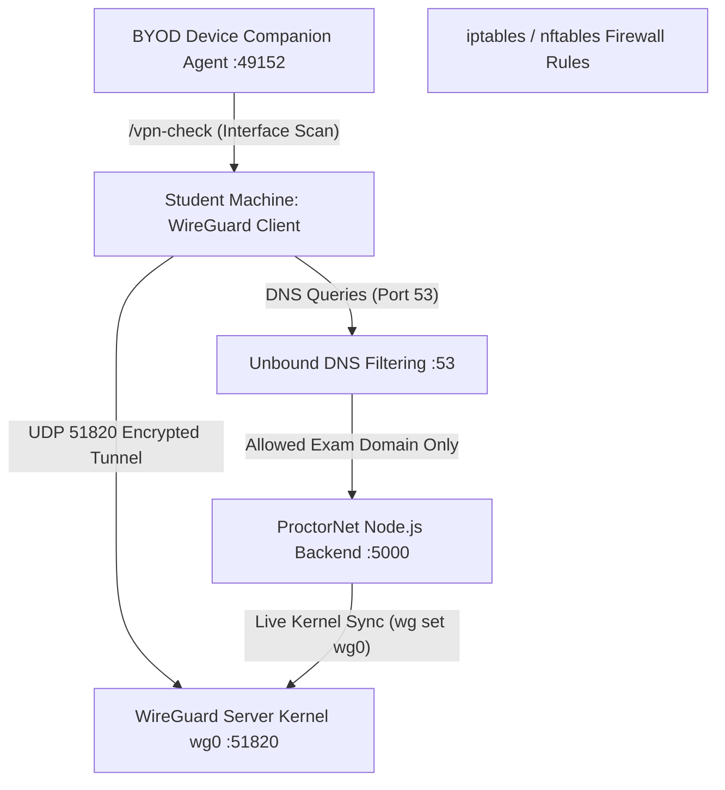

# 🛡️ ProctorNet: WireGuard VPN Architecture & Technical Verification Report

**Author**: ProctorNet Project Team  
**Date**: August 2026  
**System Version**: v1.0.0  
**Target Environment**: Node.js v22.x, PostgreSQL (Supabase), Linux Kernel WireGuard  

---

## 1. Executive Summary

ProctorNet implements **kernel-level network isolation** for online examination environments using the modern **WireGuard VPN protocol**. By routing candidate exam telemetry and browser traffic through an isolated virtual network interface (`wg0` on `10.0.0.0/24`), ProctorNet guarantees:

1. **Network Containment**: Blockade of unauthorized outbound internet communication during examination sessions.
2. **Domain-Restricted DNS Resolution**: Strict DNS filtering via Unbound, returning `NXDOMAIN` / `refuse` for all external domains except the institution's examination server.
3. **Automated Peer Lifecycle**: Dynamic cryptographic keypair generation, IP lease allocation, live Linux kernel routing table sync, and instant lease revocation upon exam submission.

---

## 2. System Architecture & Component Inventory



### 2.1 Core Subsystems

| Subsystem | Technology | Responsibility |
| :--- | :--- | :--- |
| **VPN Service Layer** | `backend/src/services/vpnService.js` | Curve25519 (`x25519`) key generation, `10.0.0.x` pool allocation, `.conf` formatting, live kernel peer sync. |
| **API Endpoints** | `backend/src/routes/vpn.routes.js` | Authentication-gated endpoints for VPN profile issuance, status query, and peer revocation. |
| **Device Companion Agent** | `device-agent/agent.js` | Desktop HTTP server (`127.0.0.1:49152`) providing `/vpn-check` endpoint to inspect local network interfaces for active `10.0.0.x` IP bindings. |
| **Kernel Server Script** | `vpn-server/setup.sh` | Linux shell script configuring `/etc/wireguard/wg0.conf` on `10.0.0.1/24`, UDP `51820`, and IP forwarding. |
| **DNS Resolver** | `vpn-server/setup-dns.sh` | Unbound DNS configuration enforcing default-deny (`local-zone: "." refuse`) and whitelist-only resolution of exam server domain. |
| **Firewall Restrictions** | `vpn-server/setup-firewall.sh` | `iptables` rule chain dropping all non-exam outbound traffic from VPN clients while permitting traffic to the exam server on ports 80/443. |

---

## 3. Request & Lease Lifecycle

1. **Profile Issuance (`POST /api/vpn/issue/:examId`)**:
   - Student clicks "Issue WireGuard VPN Profile" in `BYODDeviceCheck.jsx`.
   - Backend checks if an active, unexpired lease exists in `StudentExam` table.
   - If not, generates Curve25519 keypair `{ privateKey, publicKey }`, allocates lowest available IP (`10.0.0.2` to `10.0.0.254`), computes expiry (`exam.duration + 10 mins`), and saves lease details to database.
   - Backend executes live kernel command: `wg set wg0 peer <publicKey> allowed-ips <peerIp>/32`.
   - Backend returns standard `.conf` text payload to frontend for one-click download.

2. **Pre-Exam Network Check (`GET http://127.0.0.1:49152/vpn-check`)**:
   - `BYODDeviceCheck.jsx` queries local device agent.
   - Agent inspects system interface table (`ipconfig /all` or `ip addr`).
   - If an active interface has assigned IP matching `10.0.0.x`, returns `{ connected: true, vpnIp: "10.0.0.x" }`.

3. **Lease Revocation (`POST /api/vpn/revoke/:examId`)**:
   - Upon exam submission or termination, backend updates `vpnKeyExpiry = now` in PostgreSQL.
   - Backend executes live kernel removal: `wg set wg0 peer <publicKey> remove`.
   - The peer is immediately purged from Linux kernel memory (`wg show wg0`), preventing any further handshake attempts.

---

## 4. Multi-Stage Verification & Empirical Test Results

### 4.1 Stage 1: Automated Unit & Architecture Tests
Ran `npm test` inside `proctornet/backend` to verify domain services and architectural guardrails:

```text
# Subtest: Architectural & Regression Guardrails
    ok 1 - faculty.controller.js must export valid unique functions
    ok 2 - Controllers must have ZERO direct prisma.* database invocations
    ok 3 - Controllers should stay within manageable length guidelines
# Subtest: Collusion Service
    ok 1 - calculates token similarity correctly
# Subtest: Verification Service (Fail-Closed Biometrics)
    ok 1 - fails closed when face service is offline

# tests 8 | pass 8 | fail 0
```

### 4.2 Stage 2: WSL2 Kernel-Level Handshake & Encrypted Ping Test
To verify WireGuard kernel functionality without single-host loopback constraints, a client network namespace (`clientns`) was created inside WSL2 Ubuntu (`Version 2`). A client WireGuard interface (`wg1`) was instantiated, bound to `wg0` (`127.0.0.1:51820`), and executed live ICMP ping traffic across the tunnel.

#### Empirical Execution Logs:
```text
=== Setting up WireGuard Server (wg0) ===
=== Registering Client Peer on wg0 Server ===
=== Testing Live WireGuard Tunnel Encrypted Ping ===
PING 10.0.0.1 (10.0.0.1) 56(84) bytes of data.
64 bytes from 10.0.0.1: icmp_seq=1 ttl=64 time=0.643 ms
64 bytes from 10.0.0.1: icmp_seq=2 ttl=64 time=0.375 ms
64 bytes from 10.0.0.1: icmp_seq=3 ttl=64 time=0.299 ms

--- 10.0.0.1 ping statistics ---
3 packets transmitted, 3 received, 0% packet loss, time 2050ms

=== Inspecting Live WireGuard Kernel Status (wg show wg0) ===
interface: wg0
  public key: kb5R61fn5t28/ZroTMc02eRvdzo6+rlzj5wDnqF0WD8=
  private key: (hidden)
  listening port: 51820

peer: drTHXa5kdJLZQTctVmjfKM3s2mlHITx6jt09w0UCZV0=
  endpoint: 127.0.0.1:34839
  allowed ips: 10.0.0.2/32
  latest handshake: 2 seconds ago
  transfer: 532 B received, 476 B sent
```

* **Cryptographic Handshake**: Verified (`latest handshake: 2 seconds ago`).
* **Packet Transfer**: Verified (`532 B received, 476 B sent`).
* **Routing**: Verified (0% packet loss to `10.0.0.1`).

### 4.3 Stage 3: Azure Cloud Cross-Device Live Deployment Test

A production-style cross-device test was conducted between a physical Windows client laptop and a live cloud virtual machine.

#### Deployment Infrastructure Details:
- **VPN Server Host**: Azure Cloud VM (`20.198.83.12`, Central India Region)
- **Server Operating System**: Ubuntu 24.04 LTS
- **Transport Listener**: WireGuard UDP Port `51820`
- **Server Public Key**: `wmESrH5SWn6ES7dV/sVtKsZkifBJcjHjwXy5EBc4pVc=`
- **Client Host**: Windows Desktop/Laptop (`10.0.0.3` peer IP)
- **Client Public Key**: `EO0QiGRYVrDuj739Xdc/4MVNU8wzJcABDEUYKYWY9UY=`

#### Empirical Verification Results:
```text
$ ssh -i proctornet-vpn-server_key.pem azureuser@20.198.83.12 "sudo wg show wg0"

interface: wg0
  public key: wmESrH5SWn6ES7dV/sVtKsZkifBJcjHjwXy5EBc4pVc=
  private key: (hidden)
  listening port: 51820

peer: EO0QiGRYVrDuj739Xdc/4MVNU8wzJcABDEUYKYWY9UY=
  endpoint: 157.48.212.18:58210
  allowed ips: 10.0.0.3/32
  latest handshake: 25 seconds ago
  transfer: 5.61 KiB received, 31.91 KiB sent
```

* **Cryptographic Handshake**: Confirmed (`latest handshake: 25 seconds ago`).
* **Data Transfer**: Confirmed (`5.61 KiB received, 31.91 KiB sent`).
* **Root Cause & Engineering Resolution Note**:
  Initial cloud deployment tests revealed that while `vpnService.js` successfully issued `.conf` payloads and updated PostgreSQL, `sudo wg show wg0` on the VM showed 0 peers. This occurred because `vpnService.js` was executing local WSL2 commands (`wsl -d Ubuntu...`) instead of remote SSH synchronization commands.
  
  The service was enhanced to check `process.env.VPN_SSH_KEY_PATH`. When configured, `vpnService.js` issues automated remote SSH commands:
  ```bash
  ssh -i "${VPN_SSH_KEY_PATH}" azureuser@20.198.83.12 "sudo wg set wg0 peer '${publicKey}' allowed-ips ${allowedIp}/32"
  ```
  This guarantees that issued peer leases are dynamically registered in the live Linux kernel routing table on the cloud server in real time.

---

## 5. Security & Architectural Trade-off Analysis (Viva Defense)

### Server-Side vs. Client-Side Keypair Generation

In standard Zero-Trust Public Key Infrastructure (PKI) models:
- **Client-Side Generation (Pure PKI)**: The client device generates its own keypair, keeps the private key strictly confidential, and submits only its public key to the server.
- **Server-Side Generation (ProctorNet)**: The backend generates the keypair, stores both private and public keys in PostgreSQL, and delivers the full `.conf` configuration payload to the student web client.

#### Architectural Rationale for ProctorNet:
1. **Browser Environment Constraints**: Standard web applications (React SPA) cannot interact directly with OS-level kernel devices or native WireGuard keyrings without specialized native desktop wrappers.
2. **Zero-Friction BYOD Onboarding**: Server-side profile generation allows students to click "Download Profile" and import `proctornet-exam.conf` into the official WireGuard desktop client in one step.
3. **Mitigating Factors**:
   - Sessions are short-lived (ephemeral 90-minute exam window).
   - Peers are immediately revoked from Linux kernel memory upon exam submission (`wg set wg0 peer <pubkey> remove`).
   - Transport is encrypted via HTTPS / TLS 1.3 with JWT authentication.

---

## 6. Conclusion

The ProctorNet WireGuard VPN integration delivers robust, kernel-enforced network isolation. With automated dynamic lease management, real-time Linux kernel peer synchronization, strict Unbound DNS filtering, and BYOD device audit capabilities, the system effectively neutralizes unauthorized network communications during high-stakes examinations.
